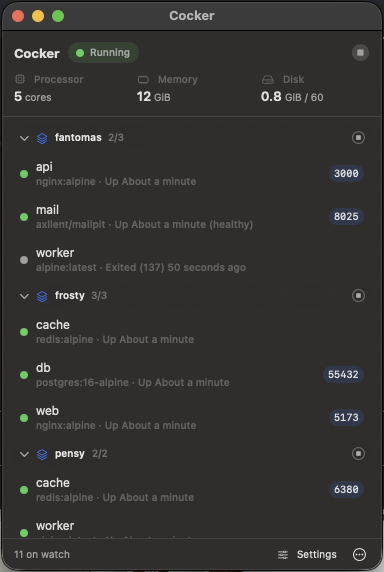
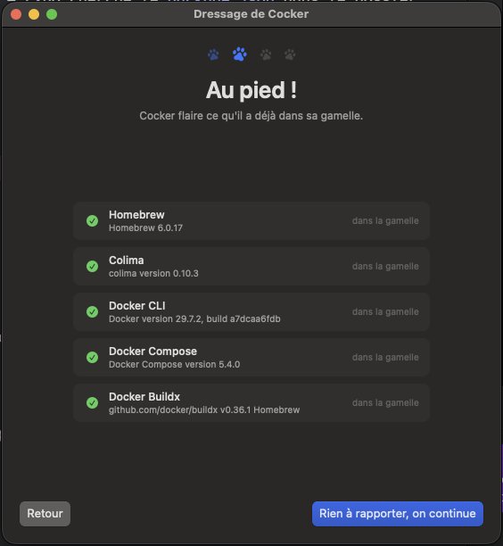
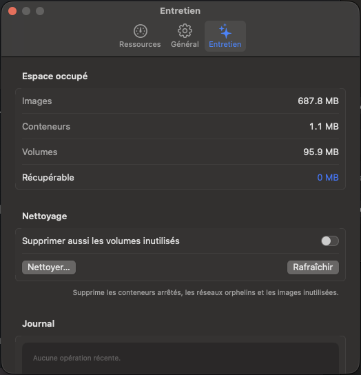
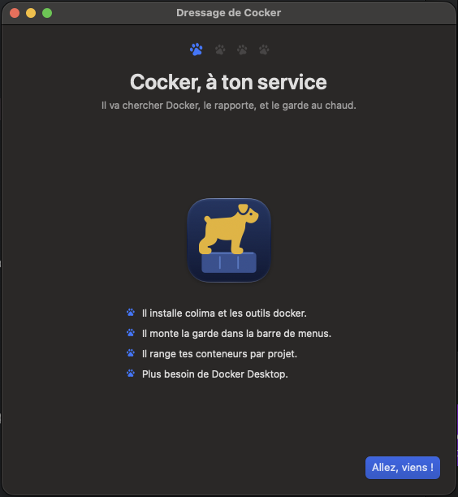
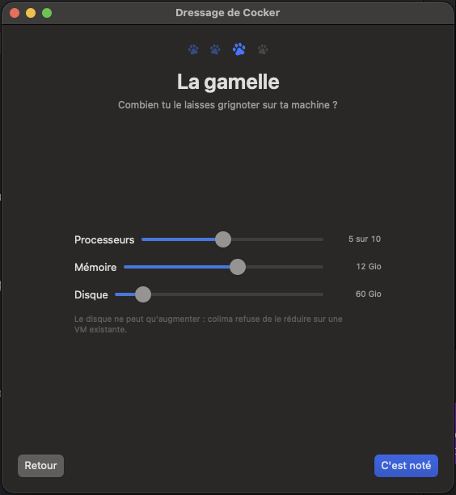
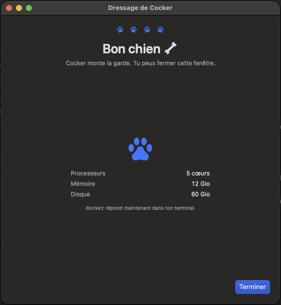
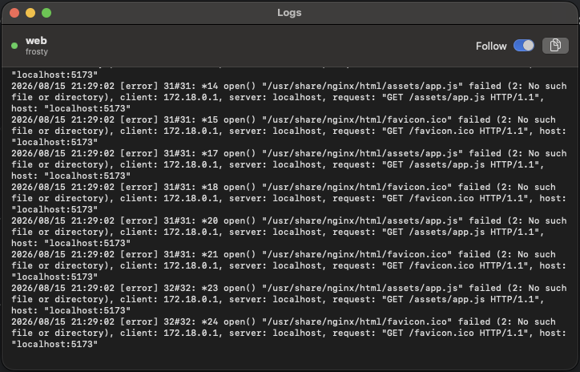

# Cocker

A menu bar Docker environment for macOS. No Docker Desktop.

Cocker installs what you need — colima, the Docker CLI, Compose, Buildx — creates
the virtual machine, starts it when you log in, groups your containers by Compose
project, and lets you decide how much of your Mac Docker is allowed to eat.

It lives in the menu bar and nowhere else. There is no Dock icon.

> Available in English and French. Cocker follows your system language by
> default, and Settings → General lets you force either one — the change
> applies immediately, no restart.

<p align="center">
  
</p>

<p align="center">
  
  
</p>

## What it does

- **Guided setup.** Detects Homebrew, colima, docker, compose and buildx, installs
  what is missing, and repairs the plugins Homebrew puts where the Docker CLI does
  not look. No terminal output — just what is happening and what to do next.
- **Containers by project.** Grouped by Compose project, collapsible, controllable
  one by one or a whole stack at a time. Published ports are clickable.
- **Logs** in their own window, with an optional follow mode.
- **Resources.** CPU, memory and disk allocated to the VM, changed from Settings.
- **Housekeeping.** Disk usage breakdown and a guarded `docker system prune`.

The colima VM keeps running after you quit Cocker: `docker` still answers in your
terminal until you stop it explicitly.

<p align="center">
  
  
  
</p>

<p align="center">
  
</p>

## Requirements

- macOS 14 (Sonoma) or later
- [Homebrew](https://brew.sh) — the one thing Cocker cannot install for you, because
  its installer needs an administrator password in a terminal. Cocker hands you the
  command to paste.

Everything else, Cocker installs.

## Install

### Homebrew

```sh
brew tap Bardyl/tap
brew install --cask cocker
```

### Download

Grab the `.dmg` from the [latest release](https://github.com/Bardyl/Cocker/releases/latest),
open it, drag Cocker to Applications. It is signed and notarized, so it opens
without argument.

A `.zip` is published alongside it for scripts and CI.

### From source

```sh
git clone https://github.com/Bardyl/Cocker.git
cd Cocker
./Scripts/bundle.sh
cp -r build/Cocker.app /Applications/
open /Applications/Cocker.app
```

Building requires Xcode 16 or later. The setup assistant opens by itself on first
launch and takes care of the rest.

## What Cocker does to your machine

Worth knowing before you run a menu bar binary that manages your containers.

- **It is not sandboxed**, and it launches `brew`, `colima` and `docker` as child
  processes. That is the whole design: Cocker is a face for command line tools, not
  a reimplementation of them. Every command it runs is visible in
  [`Core/`](Sources/Cocker/Core).
- **It writes** to `~/.colima` (through colima), to `~/.docker/cli-plugins` (symlinks
  that make `docker compose` work with a Homebrew install), and to its own
  preferences.
- **It makes one network request**: once a day, to the GitHub releases API, to see
  whether a newer version exists. You can turn that off in Settings › General. It
  makes no other outbound call, and collects nothing.
- **It asks before anything destructive.** Pruning and resizing the VM both require
  a confirmation that spells out what you lose.

## Building and testing

```sh
swift build                  # compile only, fastest loop
swift test                   # parser tests, no Docker required
./Scripts/bundle.sh          # release build, assembles build/Cocker.app
./Scripts/bundle.sh debug    # same from the debug configuration
./Scripts/make-icon.swift    # regenerate the app icon
```

`swift run` will not work: without a bundle, macOS honours neither `LSUIElement`
nor `SMAppService`. Always go through `Scripts/bundle.sh`.

See [`docs/architecture.md`](docs/architecture.md) for the decisions behind the
code — why it shells out instead of talking to the Docker API, how the PATH is
rebuilt for a GUI process, and what Cocker deliberately does not do.

## License

[MIT](LICENSE). Copyright © 2026 Mathieu Menut.

Cocker drives Homebrew, colima and the Docker CLI as separate programs. It does
not bundle them; each keeps its own license.

**Not affiliated with, endorsed by, or sponsored by Docker, Inc.** Docker and the
Docker logo are trademarks of Docker, Inc.
